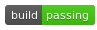
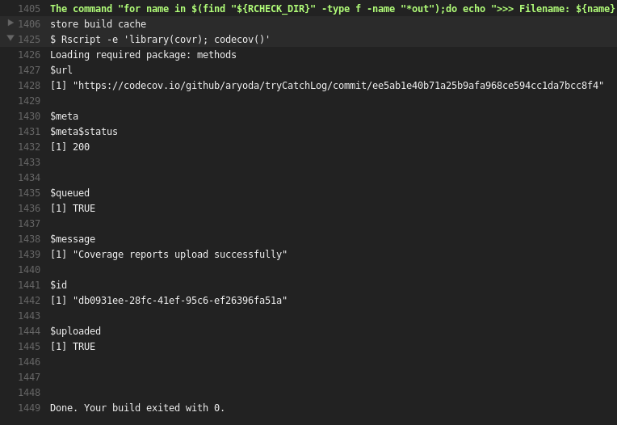

# R example repository for codecov.io

[](https://travis-ci.org/codecov/example-r) [](https://codecov.io/github/codecov/example-r) 

Example of how to integrate your **awesome** [R](http://www.r-project.org/) project with [Codecov.io](https://codecov.io)!

## Using Travis CI

Append to your `.travis.yml`

```yml
r_packages:
  - covr

after_success:
  - Rscript -e 'library(covr); codecov()'
```


### Diagnose code coverage update problems (using travis)

If your code coverage badge is not updated you should check the travis log first:

1. Check that the travis build was successful

The badge must look like this: 


2. Open the travis build log

Click on the travis build badge (picture) to open the build log.

At the end you can see code coverage section:


</br>

3. Open the log details of the code coverage

Click on the small triangle at the left side of "$ Rscript..." to see all log details:



</br>

If you do **not** see

```R
$uploaded
[1] TRUE
```

there was a problem and you will see the error message here.

If the error message is from the `covr` package you can try to find the problem by calling `covr`
on your local computer when the package source code is in the current directory with this R command:

```R
covr::package_coverage(type = "tests")
```


## Using Wercker CI
@jimhester wrote a thorough description found here: [jimhester/wercker-r-example](https://github.com/jimhester/wercker-r-example)

## Results

See the coverage reports of this repository at [codecov.io](https://codecov.io/github/codecov/example-r)


